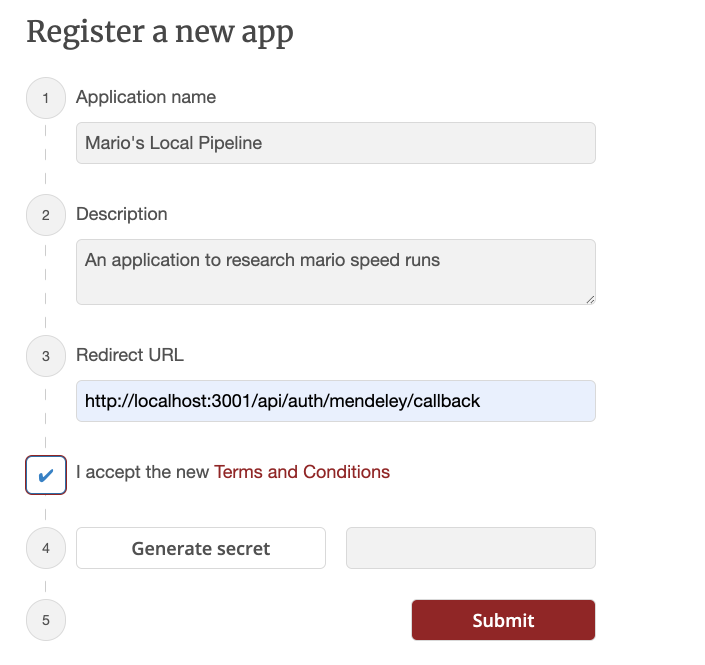
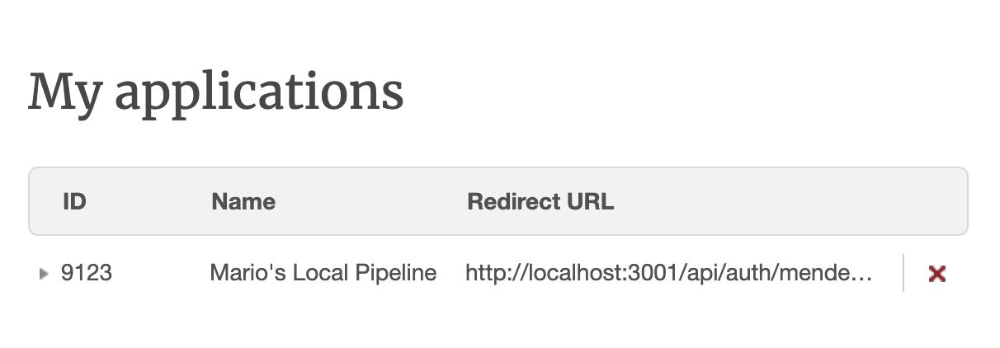

# passport-mendeley

Inspired by [passport-orcid](https://github.com/hubgit/passport-orcid)

[Passport](http://passportjs.org/) strategy for authenticating with [Mendeley](https://www.mendeley.com/) using the OAuth 2.0 API.

This module lets you authenticate using Mendeley in your Node.js applications using Passport and then use the tokens provided by the package to interact with [Mendeley's API](https://dev.mendeley.com/code/core_quick_start_guides.html)

See [Contributing](./CONTIBUTING.md) for instructions on how to contribute to this project.

## Install

```bash
$ npm install passport-mendeley
```

## Usage

#### Register your application credentials

Before using `passport-mendeley`, you must register an application with Mendeley. If you have not already done so, a new project can be created using [Mendeley's developer tools](https://dev.mendeley.com/myapps.html). Once registered, your application will be issued a client ID and client secret, which need to be provided to the strategy. You will also need to configure a redirect URI which matches the route in your application. The client secret is generated when by clicking  `Generate Secret` on register and the client ID will be avaliable after registering in the ID column of `My Applications`


##### Registering 


##### Application Data 



#### Configure Strategy

The Mendeley authentication strategy authenticates users using a Mendeley account and OAuth 2.0 tokens.  The client ID and secret obtained when creating an application are supplied as options when creating the strategy.  The strategy also requires a `verify` callback, which receives the access token and optional refresh token, as well as `params` which contains the authenticated user's Mendeley token information. The `verify` callback must call `done` providing a user to complete authentication.

```javascript
var MendeleyStrategy = require('passport-mendeley').Strategy;

passport.use(new MendeleyStrategy({
    clientID: MENDELEY_CLIENT_ID,
    clientSecret: MENDELEY_CLIENT_SECRET,
    callbackURL: "http://www.example.com/auth/mendeley/callback"
  }, async function (accessToken, refreshToken, params, profile, done) {
  // `profile` is empty as Mendeley has no generic profile URL,
  // so populate the profile object from the api instead
  const { data: profileData } = await axios.get('https://api.mendeley.com/profiles/me', {
    headers: {
      Authorization: 'Bearer ' + accessToken,
      'Content-Type': 'application/json'
    }
  })

  // Example call to mendeley to get your papers.
  const { data: papers } = await axios.get('https://api.mendeley.com/documents', {
    headers: {
      Authorization: 'Bearer ' + accessToken,
      'Content-Type': 'application/json'
    }
  })

  profile = { email: profileData.email, papers }
  return done(null, profile)
  }));
```

#### Authenticate Requests

Use `passport.authenticate()`, specifying the `'mendeley'` strategy, to authenticate requests.

For example, as route middleware in an [Express](http://expressjs.com/) application:

```javascript
app.get('/auth/mendeley',
  passport.authenticate('mendeley'));

app.get('/auth/mendeley/callback',
  passport.authenticate('mendeley', { failureRedirect: '/login' }),
  function(req, res) {
    // Successful authentication, redirect home.
    res.redirect('/');
  });
  ```

## Example

Developers using the popular [Express](http://expressjs.com/) web framework can refer to an [example](../example/index.js) as a starting point for their own web applications.
